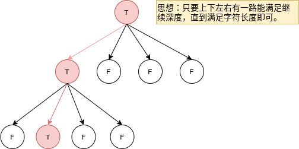

# Python剑指offer打卡-12

[toc]

## 扑克牌顺子

题目类型：数组

题目难度：:star2:

- 问题描述

  ```
  问题描述：
  	从扑克牌中随机抽5张牌，判断是不是一个顺子，即这5张牌是不是连续
  的。2～10为数字本身，A为1，J为11，Q为12，K为13，而大、小王为 0 ，
  可以看成任意数字。A 不能视为 14。
  
  解题方法：
  # 条件（大小王除外, 且不重复）
  max - min < 5
  
  注意：
  1. 不是一副扑克牌，大小王不止一张，即也有可能抽到五张大小，组成任意的
  顺子牌。
  2. 当num 输入为[]时需要考虑输出结果为False, 加上abs(0 - 14) < 5 False
  ```

- 代码

  图解：
  
  
  
  ```python
  class Solution:
  
      def isSraight(self, nums: List[int]) -> bool:
  
          repeat = set()
          mi, ma = 14, 0
          for num in nums:
              if num == 0: continue  # 遇见大小王则跳过
              mi = min(mi, num)
              ma = max(ma, num)
              if num in repeat: return False  # 有重复数值,直接返回
              repeat.add(num)
  
          return abs(ma - mi) < 5
  
      def isStraight(self, nums: List[int]) -> bool:
  
          # 先排序后计算
          nums.sort()
          joker = 0
          for i in range(4):
              if nums[i] == 0:
                  joker += 1  # 遍历有零部分
              elif nums[i] == nums[i + 1]:
                  return False  # 非零部分存在重复，不满足条件
              
          return nums[4] - nums[joker] < 5
  ```

## 求1+2+3......+n

题目类型：递归

题目难度：:star2:

- 问题描述

  ```
  问题描述：
  	求 1+2+...+n ，要求不能使用乘除法、for、while、if、else、switch、
  case等关键字及条件判断语句（A?B:C）。
  
  解题方法：
  递归，并使用逻辑运算
  ```

- 代码（[解题思路](https://leetcode-cn.com/problems/qiu-12n-lcof/solution/mian-shi-ti-64-qiu-1-2-nluo-ji-fu-duan-lu-qing-xi-/)）

  图解：
  
  
  
  ```python
  class Solution:
  
      def __init__(self):
          self.res = 0
  
      def sumNums(self, n: int) -> int:
          """递归求和"""
  
          n > 1 and self.sumNums(n - 1)
          self.res += n
          return  self.res
  ```

##　把字符串装换成整数

题目类型：字符串

题目难度：:star2::star2::star2:

- 问题描述

  ```
  问题描述：
  	写一个函数 StrToInt，实现把字符串转换成整数这个功能。不能使用
  atoi 或者其他类似的库函数。首先，该函数会根据需要丢弃无用的开头空格
  字符，直到寻找到第一个非空格的字符为止。当我们寻找到的第一个非空字
  符为正或者负号时，则将该符号与之后面尽可能多的连续数字组合起来，作
  为该整数的正负号；假如第一个非空字符是数字，则直接将其与之后连续的
  数字字符组合起来，形成整数。该字符串除了有效的整数部分之后也可能会
  存在多余的字符，这些字符可以被忽略，它们对于函数不应该造成影响。
  
  注意：假如该字符串中的第一个非空格字符不是一个有效整数字符、字符串为
  空或字符串仅包含空白字符时，则你的函数不需要进行转换。在任何情况下，
  若函数不能进行有效的转换时，请返回 0。
  ```

- 代码（[解题思路](https://leetcode-cn.com/problems/ba-zi-fu-chuan-zhuan-huan-cheng-zheng-shu-lcof/)）

  ```python
  class Solution:
      def strToInt(self, str: str) -> int:
  
          str = str.strip()
          if not str: return 0
  
          # 初始化
          res, i, sign = 0, 1, 1
          # 限制条件
          int_max, int_min, bndry = 2**31-1, -2**31, 2**31//10
          # 判断符号位，确定起始位置
          if str[0] == "-": sign = -1
          elif str[0] != "+": i = 0 # 无符号状态
          # 遍历数字部分
          for c in str[i:]:
              if not "0" <= c <= "9": break
              # 越界处理
              if res > bndry or res == bndry and c > "7": return int_max if sign == 1 else int_min
              # 更新处理
              res = 10 * res + ord(c) - ord("0")
          
          return sign*res
  
  ```

## 矩阵中的路径（<font color = red>重点</font>）

题目类型：字符串、回朔法

题目难度：:star2::star2::star2:

- 问题描述

  ```python
  问题描述：
          设计一个函数，用来判断在一个矩阵中是否存在一条包含某字符串
  所有字符的路径。路径可以从矩阵中的任意一格开始，每一步可以在矩阵
  中向左、右、上、下移动一格。如果一条路径经过了矩阵的某一格，那么
  该路径不能再次进入该格子。例如，在下面的3×4的矩阵中包含一条字符
  串“bfce”的（路径中的字母用"| |"标出）。
   
  [["a","|b|","c","e"],
  ["s","|f|","|c|","s"],
  ["a","d","|e|","e"]]
  
  但矩阵中不包含字符串“abfb”的路径，因为字符串的第一个字符b占据
  了矩阵中的第一行第二个格子之后，路径不能再次进入这个格子。
  
  解题方法:
  回朔法
  
  注意：
  1. 回朔过程中要进行还原：用来进行回溯的，如果当前的节点不满足路径要求，
  需要撤回到上一个节点，然而上一个节点此时已经赋值为“/”，需要还原一下，
  继续探索。（打标记和撤标记）。
  2. 起始点为任意一格(需要寻找入口)，且每次只能移动一格数据。
  ```

- 代码（[解题思路](https://leetcode-cn.com/problems/ju-zhen-zhong-de-lu-jing-lcof/solution/mian-shi-ti-12-ju-zhen-zhong-de-lu-jing-shen-du-yo/))

  图解：
  
  
  
  ```python
  class Solution:
  
      def exis(self, board, word: str) -> bool:
          """回溯法"""
  
          def dfs(i, j, k):
              """
              :param i: 行索引
              :param j: 列索引
              :param k: 当前查找元素
              :return:  bool
              """
  
              # 越界或不满足条件直接返回
              if not 0 <= i < len(board) or not 0 <= j < len(board[0]) or board[i][j] != word[k]: return False
              if k == len(word) - 1: return True
              # 标记已访问的路径
              board[i][j] = ""
              # 下上右左进行访问
              res = dfs(i + 1, j, k+1) or dfs(i - 1, j, k+1) or dfs(i, j + 1, k+1) or dfs(i, j - 1, k+1)
              board[i][j] = word[k]
              
              return res
  
          # 寻找入口
          for i in range(len(board)):
              for j in range(len(board[0])):
                  if dfs(i, j, 0): return True
  
          return False
  ```

## 机器人的运动范围（<font color = red>重点</font>）

题目类型：字符串、回朔法

题目难度：:star2::star2::star2:

- 问题描述

  ```
  问题描述：
  	地上有一个m行n列的方格，从坐标 [0,0] 到坐标 [m-1,n-1] 。一个机器人
  从坐标 [0, 0] 的格子开始移动，它每次可以向左、右、上、下移动一格（不能移
  动到方格外），也不能进入行坐标和列坐标的数位之和大于k的格子。例如，当
  k为18时，机器人能够进入方格 [35, 37] ，因为3+5+3+7=18。但它不能进入方格
  [35, 38]，因为3+5+3+8=19。请问该机器人能够到达多少个格子？
  
  解题方法：
  DFS和BFS
  时间复杂度:O(MN)
  空间复杂度:O(MN)
  注意条件：
  1.不能越界
  2.满足行列坐标位数和要求(不能大于的格子里面)
  3.机器人起始点为[0, 0]（区别与上一题中的任意入口）
  4. 19, 20 or 1, 2 两种情况
  ```

- 代码（[解题思路](https://leetcode-cn.com/problems/ji-qi-ren-de-yun-dong-fan-wei-lcof/solution/mian-shi-ti-13-ji-qi-ren-de-yun-dong-fan-wei-dfs-b/)）

  数位和公式
  
  ```python
  def sums(self, x):
      """位数和"""
  
      s = 0
      while x != 0:
          s += x % 10  # 求余数，得低位置
          x = x // 10  # 去低位
      return s
  ```
  
  DFS
  
  ```python
  class Solution:
  
      def movingCount(self, m: int, n: int, k, int) -> int:
  
          def dfs(i, j, si, sj):
              
              # 越界条件
              if i >= m or j >= n or k < si + sj or (i, j) in visited: return 0
              visited.add((i, j))
              # 先下后右
              return 1 + dfs(i + 1, j, si + 1 if (i + 1) % 10 else si - 8, sj) \
                     + dfs(i, j + 1, si, sj + 1 if (j + 1) % 10 else sj - 8)
              
          # 设置已访问标记
         visited = set()
          return dfs(0, 0, 0, 0)
  ```
  
  BFS
  
  ```python
  class Solution:
      def movingCount(self, m: int, n: int, k: int) -> int:
  
          queue = [(0, 0, 0, 0)]
          visited = set()
          while queue:
              i, j, si, sj = queue.pop(0)
              if i >= m or j >= n or k < si + sj or (i, j) in visited: 
                  continue
              visited.add((i, j))
              queue.append((i + 1, j, si + 1 if (i + 1)%10 else si - 8, sj))
              queue.append((i, j + 1, si, sj + 1 if (j + 1)%10 else sj - 8))
          
          return len(visited)
  ```
  
  
  
  

