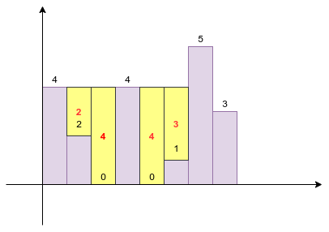
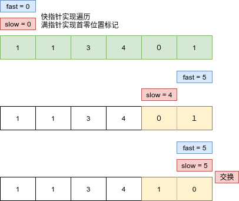
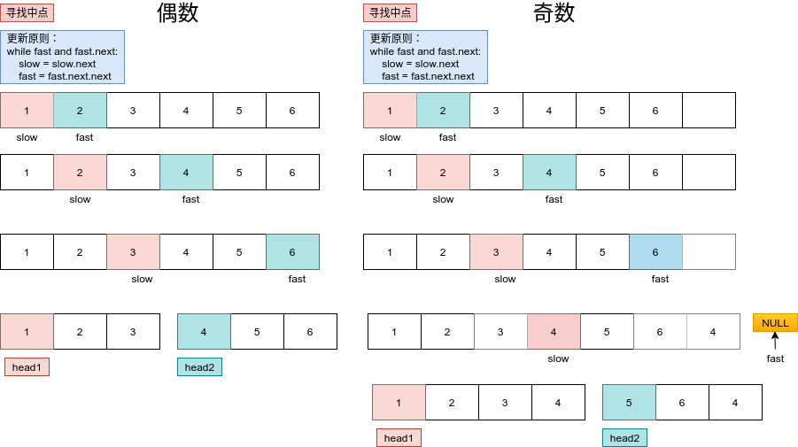
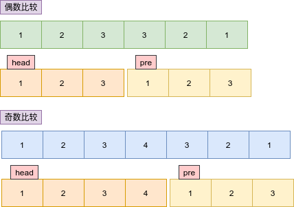

# 剑指Offer-双指针类型题目总结

[toc]

## 分发糖果（<font color = red>重点</font>）

题目类型：双指针

题目难度：:star2::star2:

- 问题描述

  ```
  问题描述：
      老师想给孩子们分发糖果，有 N个孩子站成了一条直线，老师会根据每个孩子的表现，预先给他们评分。
  你需要按照以下要求，帮助老师给这些孩子分发糖果：每个孩子至少分配到 1 个糖果。评分更高的孩子必须
  比他两侧的邻位孩子获得更多的糖果。那么这样下来，老师至少需要准备多少颗糖果呢？
  
  解题方法：
  双指针
  时间复杂度：O(N)
  空间复杂度：O(N)
  ```

- 代码

  ```python 
  class Solution:
      def candy(self, ratings: List[int]) -> int:
  
          left = [1 for _ in range(len(ratings))]
          right = left[:]
          # 左遍历
          for i in range(1, len(ratings)):
              if ratings[i] > ratings[i - 1]:
                  left[i] = left[i - 1] + 1
          cnt = left[-1]
  
          # 右遍历
          for i in range(len(ratings) - 2, -1, -1):
              if ratings[i] > ratings[i + 1]:
                  right[i] = right[i + 1] + 1
  
              cnt += max(left[i], right[i])
              
          return cnt
  ```

## 长度最小的子数组（<font color = red>重点</font>）

题目类型：双指针、数组

题目难度：:star2::star2:

- 问题描述

  ```
  问题描述：
      给定一个含有n个正整数的数组和一个正整数 target 。找出该数组中满足其和 ≥ target
  的长度最小的连续子数组[numsl, numsl+1, ..., numsr-1, numsr] ，并返回其长度。
  如果不存在符合条件的子数组，返回 0 。
  
  解题方法：
  (1)暴力法
  时间复杂度：O(N*N)
  空间复杂度：O(1)
  
  (2)双指针法
  注意以下情况的返回值
  nums: [1, 1, 1, 1, 1, 1, 1, 1]
  target: 11
  实际ans值：8
  预计ans值：>= target
  不满足直接退出
  时间复杂度：O(N)
  空间复杂度：O(1)
  ```

- 代码

  暴力法

  ```python
  class Solution:
      # 暴力法
      def minSubArrayLen(self, target: int, nums: List[int]) -> int:
  
          if not nums:
              return 0
          ans = len(nums) + 1
          n = len(nums)
          for i in range(n):
              total = 0
              for j in range(i, n):
                  total += nums[j]
                  if total >= target:
                      ans = min(ans, j - i + 1)
          return ans
  ```
  
  双指针法

  ```python
  class Solution:
      def minSubArrayLen(self, target: int, nums: List[int]) -> int:
  
          if not nums:
              return 0
  
          left, right = 0, 0
          n = len(nums)
          ans = n + 1
          total = 0
  
          while right < n:
              total += nums[right]
              while total >= target:
                  ans = min(ans, right - left + 1)
                  total -= nums[left]
                  left += 1
              right += 1
  
          return 0 if ans == n + 1 else ans
  ```

## 接雨水（<font color = red>重点</font>）

题目类型：双指针

题目难度：:star2::star2::star2::star2::star2:

- 问题描述

  ```
  问题描述：
      　给定 n 个非负整数表示每个宽度为 1 的柱子的高度图，计算按此排列的柱子，
  下雨之后能接多少雨水。
  示例：
  输入：height = [0,1,0,2,1,0,1,3,2,1,2,1]
  输出：6
  解释：上面是由数组 [0,1,0,2,1,0,1,3,2,1,2,1] 表示的高度图，
  在这种情况下，可以接 6 个单位的雨水（蓝色部分表示雨水）。
  
  解题方法：
  (1）暴力法
  遍历每一个下标的额左右区间，寻找可能的凹槽
  时间复杂度：O(N^2)
  空间复杂度：O(1)
  (2)双指针
  使用left和right指针，遍历所有节点
  时间复杂度：O(N)
  空间复杂度：O(1)
  ```

- 代码（[解题思路](https://leetcode-cn.com/problems/trapping-rain-water/solution/dong-tai-gui-hua-shuang-zhi-zhen-tu-jie-by-ml-zimi/)）

  图解算法

  

  ```python
  from typing import List
  
  
  class Sulution:
  
      def trap(self, height: List[int]) -> int:
          """接雨水（暴力法）"""
  
          ans = 0
          # 遍历下标
          for i in range(len(height)):
              max_left, max_right = 0, 0
              for j in range(0, i):
                  max_left = max(max_left, height[j])
              for j in range(i, len(height)):
                  max_right = max(max_right, height[j])
              # 盛雨水，形成凹槽
              if min(max_left, max_right) > height[i]:
                  ans += min(max_left, max_right) - height[i]
  
          return ans
  
      def trap(self, height:List[int]) -> int:
          """双指针法"""
  
          if not height: return 0
          n = len(height)
          ans = 0
          left, right = 0, n - 1
          max_left, max_right = height[0], height[n - 1]
  
          while left <= right:
              max_left = max(max_left, height[left])
              max_right = max(max_right, height[right])
              if max_left < max_right:
                  ans += max_left - height[left]
                  left += 1
              else:
                  ans += max_right - height[right]
                  right -= 1
  
          return ans
  ```


## 移动零（<font color = red>重点</font>）

题目类型：双指针

题目难度：:star2:

- 问题描述

  ```
  问题描述：
      　给定一个数组 nums，编写一个函数将所有 0 移动到数组的末尾，同时保持
  非零元素的相对顺序。
  
  要求：
  (1) 必须在原数组上操作，不能拷贝额外的数组。
  (2) 尽量减少操作次数。
  
  示例：
  输入: [0,1,0,3,12]
  输出: [1,3,12,0,0]
  
  解题方法：
  １．暴力法：
  时间复杂度：O(N)
  空间复杂度：O(N)
  
  ２．双指针
  首次快慢指针分离之后：
  slow 始终指向第一个为零的数组的位置
  fast 始终指向不为零的数组位置
  时间复杂度：O(N)
  空间复杂度：O(1)
  ```

- 代码

  图解

  

  ```python
  class Solution:
  
      def moveZeros1(self, nums):
          """暴力法"""
  
          if not nums:
              return
          j = 0
          tmp_array = [0] * len(nums)
          for i in range(len(nums)):
              if nums[i] != 0:
                  tmp_array[j] = nums[i]
                  j += 1
  
          return tmp_array
  
      def moveZeroes2(self, nums: List[int]) -> None:
          """
          Do not return anything, modify nums in-place instead.
          """
          slow = fast = 0
          while fast < len(nums):
              if nums[fast] != 0:
                  # 保证快慢的前提条件
                  if fast != slow:
                      nums[slow], nums[fast] = nums[fast], nums[slow]
                  slow += 1
              fast += 1
  ```


## 回文链表（<font color = red>重点</font>）

题目类型：链表、回文数

题目难度：:star2::star2::star2::star2:

- 问题描述

  ```
  问题描述：
  请判断一个链表是否为回文链表。
  进阶：
  你能否用 O(n) 时间复杂度和 O(1) 空间复杂度解决此题？
  
  解题方法：
  （1）遍历（判断正向和反向结果是否一致）
  使用有个临时数组对遍历节点数值进行存储，并比较
  时间复杂度：O(n)  遍历所有节点
  空间复杂度：O(n)  临时数组
  （2）快慢指针
  两种情况：
   奇数：1 2 3 4 5  ||  4 3 2 1-->pre
   偶数：1 2 3 4  || 4 3 2 1-->pre
   用快慢指针寻找链表的中心位置，将链表进行分割l1和l2,并且已证明
  l1链表的长度始终大于等于l2链表的长度，因此将 l2 链表进行翻转与 l1
  链表进行比较。
  时间复杂度：O(n)  遍历所有节点
  空间复杂度：O(1) 没有使用额外空间
  
  注意：
  此题与链表翻转和排序链表知识点相同, 此外，只有一个节点时，链表是回文的。
  ```

- 图解快慢指针取中点

  

- 链表翻转之后比较图解

  

- 代码（[解题思路](https://leetcode-cn.com/problems/palindrome-linked-list/solution/kuai-man-zhi-zhen-lian-biao-ni-xu-by-airesearcherj/)）

  ```python
  class Solution:
  
      def isPalindrom1(self, head):
          # 临时数组进行存储
          vars = []
          cur = head
          while cur:
              vars.append(cur.val)
              cur = cur.next
  
          return vars == vars[::-1]
  
      def isPalindrom2(self, head):
      
          if not head or not head.next:
              return True
          # 快慢指针
          slow, fast = head, head.next
          while fast and fast.next:
              fast = fast.next.next
              slow = slow.next
          cur = slow.next
          slow.next = None
          pre = None
          # 链表翻转
          while cur:
              tmp = cur.next
              cur.next = pre
              pre = cur
              cur = tmp
          # 比较回文
          while pre:
              if head.val != pre.val:
                  return False
              head = head.next
              pre = pre.next
  
          return True
  ```

## 环形链表（<font color = red>重点</font>）

题目类型：链表

题目难度：:star2::star2:

### 存在环

- 问题描述

  ```
  给定一个链表，判断链表中是否有环。
  
         如果链表中有某个节点，可以通过连续跟踪 next 指针再次到达，则链表中存在
  环。 为了表示给定链表中的环，我们使用整数 pos 来表示链表尾连接到链表中的位
  置（索引从 0 开始）。 如果 pos 是 -1，则在该链表中没有环。注意：pos 不作为参
  数进行传递，仅仅是为了标识链表的实际情况。如果链表中存在环，则返回 true。 
  否则，返回 false 。
  进阶：
  你能用 O(1)（即，常量）内存解决此问题吗？
  变体：环形链表II
  
  解题方法：
  (1)哈希表
  时间复杂度：O(n)　
  空间复杂度：O(n)
  
  (2)快慢指针
  时间复杂度：O(n)　
  空间复杂度：O(1)
  ```

- 代码（[解题思路](https://leetcode-cn.com/problems/linked-list-cycle-ii/solution/142-huan-xing-lian-biao-ii-jian-hua-gong-shi-jia-2/)）

  图解快慢指针相遇(存在环)

  

  ```python
  class ListNode:
      def __init__(self, x):
          self.val = x
          self.next = None
  
  
  class Solution:
  
      def hasCycle1(self, head):
  
          seen = set()
          while head:
              if head in seen:
                  return True
              seen.add(head)
              head = head.next
  
          return False
  
      def hasCycle2(self, head: ListNode) -> bool:
  
          if not head or not head.next:
              return False
  
          slow, fast = head, head.next
          while fast and fast.next:
              fast = fast.next.next
              slow = slow.next
              if slow == fast:
                  return True
  
          return False
  ```

### 环的入口结点

- 问题描述

  ```
  问题描述：
          给定一个链表，返回链表开始入环的第一个节点。如果链表无环，则返回null。
  为了表示给定链表中的环，我们使用整数 pos 来表示链表尾连接到链表中的位置（
  索引从 0 开始）。 如果 pos 是 -1，则在该链表中没有环。注意，pos 仅仅是用于标
  识环的情况，并不会作为参数传递到函数中。说明：不允许修改给定的链表。
  进阶：
  你是否可以使用 O(1) 空间解决此题？
  
  描述：我先找到你，然后我们步调一致，最终在入口处相遇。
  
  解题方法：
  （1）栈
  时间复杂度：O(N)
  空间复杂度：O(N)
  （2）快慢指针
  从头结点出发一个指针，从相遇节点 也出发一个指针，这两个指针每次只走一个节点， 
  那么当这两个指针相遇的时候就是 环形入口的节点.
  时间复杂度：O(N)
  空间复杂度：O(1)
  ```

- 代码

  ```python
  class Solution:
      def detectCycle(self, head: ListNode) -> ListNode:
  
          slow, fast = head, head
          while fast and fast.next:
              slow = slow.next
              fast = fast.next.next
              if slow == fast:
                  p = head
                  q = slow
                  while p != q:
                      p = p.next
                      q = q.next
                  return q
  
          return None
  ```

##  删除链表的倒数第N个结点（<font color=red>重点</font>）

题目类型：链表

题目难度：:star2::star2:

- 问题描述

  ```
  问题描述：
         给你一个链表，删除链表的倒数第 n 个结点，并且返回链表的头结点。
  进阶：你能尝试使用一趟扫描实现吗？
  
  示例：
  输入：head = [1,2,3,4,5], n = 2
  输出：[1,2,3,5]
  
  解题方法：
  双指针（K + M = M + K）
  时间复杂度:O(N) former指针实现一趟扫描
  空间复杂度:O(1)
  ```

- 代码

  图解快慢指针变化

  

  ```python
  class ListNode:
      def __init__(self, val=0, next=None):
          self.val = val
          self.next = next
  
  
  class Solution:
      def removeNthFromEnd(self, head: ListNode, n: int) -> ListNode:
  
          dummy = ListNode(0, head)
          former, latter = head, dummy
          # 寻找K
          for i in range(n):
              if not former: break
              former = former.next
          while former:
              latter = latter.next
              former = former.next
  
          # 删除结点
          latter.next = latter.next.next
          return dummy.next
  ```

## 两个链表的第一个公共结点（浪漫相遇）:heart:

题目类型：链表、双指针

题目难度：:star2::star2:


- 问题描述

  ```python
  问题描述：
  输入两个链表，找出它们的第一个公共节点。
  
  解决方案：
  1. 暴力搜索
  No Recommend
  2.使用栈从后向前找出第一个不相等的结点
  A:1 2 5 6
  公共结点---->10 11 55 88
  B:2 4 8 9
  3. 交替遍历指针
  时间复杂度：（M + N）
  空间复杂度：（１）
  p1 -> --->......p1=p2
  p2 --> ---->......return p1
  实例：
  a:(1 2 3 4 ) 10 10 10
  b:(0 7 8 9 6 5 2)  10 10 10
  c(公共部分): 10 10 10
  a + c + b = b + c + a
  
  时间复杂度：O(a + b)
  空间复杂度：O(1)
  ```

- 代码（[解题思路](https://leetcode-cn.com/problems/liang-ge-lian-biao-de-di-yi-ge-gong-gong-jie-dian-lcof/solution/shuang-zhi-zhen-fa-lang-man-xiang-yu-by-ml-zimingm/)）

  ```python
  class Solution:
  
      def findFirstCommonNode(self, pHead1, pHead2):
          """烂漫相遇问题（我走过你来时的路）"""
  
          node1, node2 = pHead1, pHead2
          
          while node1 != node2:
              node1 = node1.next if node1 else pHead2
              node2 = node2.next if node2 else pHead1
              
          return node1
  ```

## 链表中倒数第k个结点（<font color = red>重点</font>）

题目类型：链表、双指针

题目难度：:star2::star2::star2:

- 问题描述

  ```python
  问题描述：
  输入一个链表，输出该链表中倒数第k个结点
  
  解决方法：
  方法1：
  使用栈存储，先进后出。
  
  方法2：
  双指针(双指针相差k，先前指针走完时，正好后指针到指定结点)
   former + after = after + former
   K + M = Ｍ + K
  时间复杂度：O(N)
  空间复杂度：O(1)
  ```

- 代码（[解题思路](https://leetcode-cn.com/problems/lian-biao-zhong-dao-shu-di-kge-jie-dian-lcof/solution/mian-shi-ti-22-lian-biao-zhong-dao-shu-di-kge-j-11/))

  算法图解：

  

  ```python
  class Solution:
      
      def FindKthToTail(self, head, k):
          """双指针，两个指针之间相差k值"""
  
          former, latter = head, head
          for _ in range(k):
              # 提前判断K是否满足要求
              if not former: return None
              former = former.next
  
          while former:
              former = former.next
              latter = latter.next
  
          return latter
  ```

## 盛水最多的容器（<font color = red>重点</font>）

题目类型：双指针

题目难度：:star2:

- 问题描述

  ```
  问题描述:
          给你 n 个非负整数 a1，a2，...，an，每个数代表坐标中的一个点(i,ai) 。在
  坐标内画 n 条垂直线，垂直线 i的两个端点分别为(i,ai) 和 (i, 0) 。找出其中的两
  条线，使得它们与x轴共同构成的容器可以容纳最多的水。
  说明：你不能倾斜容器。
  
  解题方法：
  解题原则，容器盛水的容量是由短边决定的。
  (1)暴力法
  时间复杂度:O(N^2)
  空间复杂度:O(1)
  
  (2)双指针法
  原则：容器的最大面积是由短板决定的，固定长板，移动短板。
  时间复杂度:O(N)
  空间复杂度:O(1)
  
  双指针移动的合理性：
          其实无论是移动短指针和长指针都是一种可行求解。 只是一开始就已经把指针定义
  在两端，如果短指针不动，而把长指针向着另一端移动，两者的距离已经变小了，无论
  会不会遇到更高的指针，结果都只是以短的指针来进行计算。 故移动长指针是无意义的。
  ```

- 代码（[解题思路](https://leetcode-cn.com/problems/container-with-most-water/solution/container-with-most-water-shuang-zhi-zhen-fa-yi-do/)）

  ```python
  class Solution:
  
      def maxArea(self, height) -> int:
          """暴力法"""
  
          # 双重遍历
          max_area = 0
          for i in range(len(height)):
              for j in range(i + 1, len(height)):
                  # 短边决定
                  if height[i] < height[j]:
                  	max_area = max(max_area, height[i] * (j - i))
  	       else:
              	    max_area = max(max_area, height[j] * (j - i))	
          return max_area
  
      def maxArea(self, height) -> int:
          """双指针"""
  
          i, j, res = 0, len(height) - 1, 0
  
          while i < j:
              # 始终移动短指针
              if height[i] < height[j]:
                  res = max(res, height[i] * (j - i))
                  i += 1
              else:
                  res = max(res, height[j] * (j - i))
                  j -= 1
          return res
  ```

