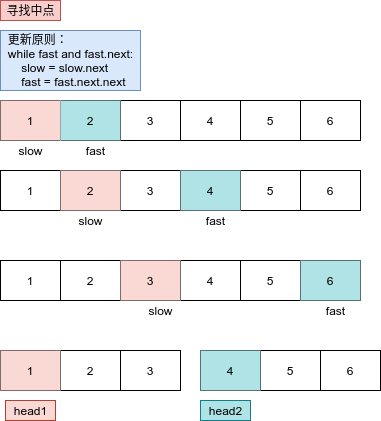
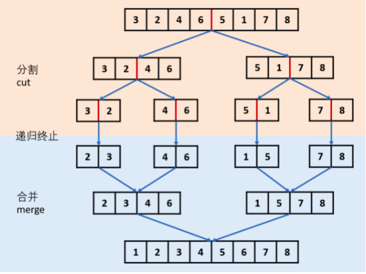

# 剑指Offer-经典排序算法题目总结

[toc]

## 搜索旋转排序数组（<font color = red>重点</font>）

题目类型：二分法

题目难度：:star2::star2::star2::star2:

- 问题描述

  ```
  问题描述：
      整数数组 nums 按升序排列，数组中的值 互不相同 。在传递给函数之前，nums 在预先未知的某个下标
  k（0 <= k < nums.length）上进行了 旋转，使数组变为 [nums[k], nums[k+1], ..., nums[n-1],
  nums[0], nums[1], ..., nums[k-1]]（下标 从 0 开始 计数）。例如， [0,1,2,4,5,6,7] 在下标
  3 处经旋转后可能变为[4,5,6,7,0,1,2] 。给你 旋转后 的数组 nums 和一个整数 target ，如果
  nums 中存在这个目标值 target ，则返回它的下标，否则返回-1。
  
  
  解题方法：
  二分法
  时间复杂度：O(logn)
  空间复杂度：O(1)
  ```

- 二分法代码

  ```python
  class Solution:
      def search(self, nums: List[int], target: int) -> int:
  
          
          low, high = 0, len(nums) - 1
  
          while low <= high:
              mid = (low + high) // 2
  
              if nums[mid] > target:
                  high = mid - 1
              elif nums[mid] < target:
                  low = mid + 1
              else:
                  return mid
          
          return -1
  ```

- 代码

  ```python
  class Solution:
      def search(self, nums: List[int], target: int) -> int:
  
          if not nums: return -1
  
          l, r = 0, len(nums) - 1
          while l <= r:
  
              mid = (l + r) // 2
              if nums[mid] == target:
                  return mid
              if nums[0] <= nums[mid]:
                  if nums[0] <= target < nums[mid]:
                      r = mid - 1
                  else:
                      l = mid + 1
              else:
                  if nums[mid] < target <= nums[-1]:
                      l = mid + 1
                  else:
                      r = mid - 1
          return -1
  ```

## 排序数组

题目类型：排序

题目难度：:star2::star2::star2::star2:

- 问题描述

  ```
  问题描述：
  给你一个整数数组 nums，请你将该数组升序排列。
  
  解题思路：
  快速排序（比较点的选择增加随机性）和归并排序
  ```

- 代码（[解题思路](https://leetcode-cn.com/problems/sort-an-array/solution/fu-xi-ji-chu-pai-xu-suan-fa-java-by-liweiwei1419/)）

  快速排序

  ```python
  import random
  
  
  class Solution:
      def sortArray(self, nums: List[int]) -> List[int]:
  
          def quickSort(nums, strat, end):
              if strat >= end:
                  return 
              i, j = strat, end
              # 随机选择起始比较点
              index = random.randint(i, j)
              nums[i], nums[index] = nums[index], nums[i]
              pivot = nums[i]
              while i < j: 
                  while i < j and nums[j] >= pivot:
                      j -= 1
                  nums[i] = nums[j]
                  while i < j and nums[i] < pivot:
                      i += 1
                  nums[j] = nums[i]
              nums[i] = pivot
              quickSort(nums, strat, i - 1)
              quickSort(nums, i + 1, end)
          
          quickSort(nums, 0, len(nums) - 1)
          return nums
  ```

  归并排序

  ```python
  class Solution:
      def sortArray(self, nums: List[int]) -> List[int]:
  
          if len(nums) <= 1:
              return nums
  
          mid = len(nums) // 2
          left, right = nums[:mid], nums[mid:]
          # 拆分
          return self.merge(self.sortArray(left), self.sortArray(right))
  
      def merge(self, left, right):
  
          result = []
  
          # 公共部分比较合并
          while left and right:
              if left[0] < right[0]:
                  result.append(left.pop(0))
              else:
                  result.append(right.pop(0))
  
          # 剩余部分合并
          while left:
              result.append(left.pop(0))
          while right:
              result.append(right.pop(0))
  
          return result
  ```

## 数组中的逆序对

题目类型：排序

题目难度：:star2::star2::star2:

- 问题描述

  ```
  问题描述：
      在数组中的两个数字，如果前面一个数字大于后面的数字，则这两个数字组成一个逆序对。
  输入一个数组，求出这个数组中的逆序对的总数。
  
  示例：
  输入: [7,5,6,4]
  输出: 5
  [5, 7] [4]
  解题方法：
  归并排序
  ```

- 代码（[解题思路](https://leetcode-cn.com/problems/shu-zu-zhong-de-ni-xu-dui-lcof/solution/jian-zhi-offer-51-shu-zu-zhong-de-ni-xu-pvn2h/)）

  ```python
  class Solution:
      def __init__(self):
          self.cnt = 0
  
      def reversePairs(self, nums: List[int]) -> int:
  
          self.mergeSort(nums)
          return self.cnt
  
      def mergeSort(self, nums):
  
          if len(nums) <= 1:
              return nums
  
          mid = len(nums) // 2
          left, right = nums[:mid], nums[mid:]
          # 拆分
  
          return self.merge(self.mergeSort(left), self.mergeSort(right))
  
      def merge(self, left, right):
  
          i, j = 0, 0
          result = []
          while i < len(left) and j < len(right):
  
              if left[i] <= right[j]:
                  result.append(left[i])
                  i += 1
              else:
                  # [1 2 5], [3, 4]
                  result.append(right[j])
                  j += 1
                  self.cnt += (len(left) - i)
  
          result += left[i:]
          result += right[j:]
  
          return result
  ```

## X 的平方根（<font color = red>重点</font>）

题目类型：数字

题目难度：:star2::star2:

- 问题描述

  ```
  问题描述：
          实现int sqrt(int x)函数。计算并返回x的平方根，其中x 是非负整数。
  由于返回类型是整数，结果只保留整数的部分，小数部分将被舍去。
  
  解题方法：
  (1)袖珍计算器
  时间复杂度：O(1)
  空间复杂度：O(1)
  (2)二分法
  时间复杂度：O(logN)
  空间复杂度：O(1)
  ```

- 代码（[解题思路](https://leetcode-cn.com/problems/sqrtx/solution/x-de-ping-fang-gen-by-leetcode-solution/)）

  袖珍计算器

  ```python
  import math
  
  
  class Solution:
      def mySqrt(self, x: int) -> int:
          
          if x == 0:
              return 0
          ans = int(math.exp(0.5*math.log(x)))
  
          return ans + 1 if (ans + 1)**2 <= x else ans
  ```

  二分法

  ```python
  class Solution:
      
      def mySqrt(self, x: int) -> int:
          # 二分查找
  
          l, r, ans = 0, x, -1
          while l <= r:
              mid = (l + r) // 2
              if mid * mid <= x:
                  ans = mid
                  l = mid + 1
              else:
                  r = mid - 1
  
          return ans
  ```

  牛顿的迭代法(可求得精确解)

  ```python
  class Solution:
      def mySqrt(self, x: int) -> int:
  
          if x <= 1:
              return x
          x0, C = float(x), float(x)
          while True:
              xi = 0.5*(x0 + C/x0)
              if abs(xi - x0) < 1e-7:
                  break
              x0 = xi
          return int(x0)
  ```

## 数组中的第K个最大元素（<font color = red>重点</font>）

题目类型：数组

题目难度：:star2::star2::star2:

- 问题描述

  ```
  题目描述：
          给定整数数组 nums 和整数 k，请返回数组中第 k 个最大的元素。请注意，
  你需要找的是数组排序后的第 k 个最大的元素，而不是第 k 个不同的元素。
  
  解题方法：
  改进的快速排序
  	思想：基本的快速排序选取第一个或者最后一个元素作为基准。这样在数组已
  经有序的情况下，每次划分将得到最坏的结果。一种比较常见的优化方法是随机化
  算法，即随机选取一个元素作为基准。这种情况下虽然最坏情况仍然是O(n2)，但最
  坏情况不再依赖于输入数据，而是由于随机函数取值不佳。实际上，随机化快速排
  序得到理论最坏情况的可能性仅为1/(2n)。所以随机化快速排序可以对于绝大多数
  输入数据达到O(nlogn)的期望时间复杂度。
  时间复杂度：O(NlogN)
  空间复杂度：O(1)
  ```

- 代码

  快速排序

  ```python
  class Solution:
      def findKthLargest(self, nums: List[int], k: int) -> int:
  
          def quickSort(low, high):
              if low >= high:
                  return 
              
              # 设置边界条件
              i, j = low, high
              pivot = nums[i]
              while i < j:
                  while i < j and nums[j] >= pivot:
                      j -= 1
                  nums[i] = nums[j]
                  
                  while i < j and nums[i] < pivot:
                      i += 1
                  nums[j] = nums[i]
              nums[i] = pivot
              quickSort(low, i - 1)
              quickSort(i + 1, high)
          
          quickSort(0, len(nums) - 1)
  
          return nums[-k]
  ```

  改进的快速排序

  ```python
  import random
  
  
  class Solution:
      def findKthLargest(self, nums: List[int], k: int) -> int:
  
          def quickSort(nums, start, end):
  
              if start >= end:
                  return 
              
              # 随机初始化基准
              low, high = start, end
              index = random.randint(low, high)
              nums[low], nums[index] = nums[index], nums[low]
              pivot = nums[low]
  
              while low < high:
                  while low < high and nums[high] >= pivot:
                      high -= 1
                  nums[low] = nums[high]
                  while low < high and nums[low] < pivot:
                      low += 1
                  nums[high] = nums[low]
              # 置换
              nums[low] = pivot
              
              # 节省不必要的分裂开支
              if len(nums) - k < low: 
                  quickSort(nums, start, low - 1)
              else: 
                  quickSort(nums, low + 1, end)
          
          quickSort(nums, 0, len(nums) - 1)
          return nums[len(nums) - k]
  ```

## 数组在升序数组中出现的次数

题目类型：数组、二分法

题目难度：:star2::star2::star2:

- 问题描述

  ```python
  问题描述：
  统计一个数字在排序数组中出现的次数
  
  实例：
  输入: nums = [5,7,7,8,8,10], target = 8
  输出: 2
  
  解题方法：
  因为题目中出现了"排序"，所以应该首先想到二分查找
  二分法查找
  时间复杂度：O(logn)
  ```

- 知识点

  二分法（[二分法查找](https://www.cnblogs.com/johnhery/p/9936335.html)）

  二分法查找适用于数据量较大时，但是数据需要<font color ="red">先排好顺序</font>。主要思想是：（设查找的数组区间为array[low, high]）

  

  二分查找演示代码

  注意:二分查找边界值为:==low <= high==

  

  ```python
  class Solution:
  
      def binarySearch(self, nums, target):
          """
          二分查找法
          :param nums: 有序列表 
          :param target: 查找目标
          :return: 指定元素值，无则返回-1
          """
          
          low = 0
          high = len(nums) - 1
          
          while low <= high:
              mid = (low + high) >> 1
              if nums[mid] > target:
                  high = mid - 1
              elif nums[mid] < target:
                  low = mid + 1
              else:
                  return nums[mid]
  
          return -1
  ```

- 代码（[解题思路](https://leetcode-cn.com/problems/zai-pai-xu-shu-zu-zhong-cha-zhao-shu-zi-lcof/solution/)）

  ```python
  class Solution:
      def search(self, nums: List[int], target: int) -> int:
  
          def helper(tar):
              """寻找指定数值的右边界"""
  
              i, j = 0, len(nums) - 1
  
              while i<=j:
                  mid = (i + j) // 2
                  if nums[mid] <= tar:  # j == i
                      i = mid + 1
                  else:
                      j = mid - 1  # j < i　越界
              return i   # 返回右边界的索引
          
          return helper(target) - helper(target - 1)
  ```

## 在排序数组中查找元素的第一个和最后一个位置

题目类型：二分法

题目难度：:star2::star2::star2::star2:

- 问题描述

  ```
  问题描述：
      给定一个按照升序排列的整数数组 nums，和一个目标值 target。找出给定目标值在数组
  中的开始位置和结束位置。如果数组中不存在目标值 target，返回[-1, -1]。
  
  解题方法：
  二分法
  时间复杂度：O(logN)
  空间复杂度：O(1)
  ```

- 代码

  ```python
  class Solution:
      def searchRange(self, nums: List[int], target: int) -> List[int]:
  
          if target not in nums: return [-1, -1]
  
          def helper(tar):
  
              l, r = 0, len(nums) - 1
              while l <= r:
                  mid = (l + r) // 2
                  if tar >= nums[mid]:
                      l = mid + 1
                  else:
                      r = mid - 1
              return l
  
          return [helper(target - 1), helper(target) - 1]
  ```

## 排序链表

题目类型：排序

- 问题描述

  ```
  问题描述：
          给你链表的头结点head，请将其按 升序 排列并返回 排序后的链表 。
  进阶：你可以在O(nlogn) 时间复杂度和常数级空间复杂度下，对链表进
  行排序吗？
  
  示例：
  输入：head = [4,2,1,3]
  输出：[1,2,3,4]
  
  解题方法：
  归并排序
  时间复杂度：O(nlogn)
  空间复杂度：O(n)  # 合并时，需要通过临时结点节点存储合并数值
  ```

- 代码（[解题思路](https://leetcode-cn.com/problems/sort-list/solution/148-gui-bing-pai-xu-lian-biao-jian-dan-d-0lyw/)）

  快慢指针寻找中点图解：

  

  

  ```python
  class Solution:
      def sortList(self, head: ListNode) -> ListNode:
          """合并排序"""
          
          # 只有一个节点时，各子部分有序
          if not head or not head.next:
              return head
          # 查找二分有的右节点
          slow, fast = head, head.next
          while fast and fast.next:
              slow = slow.next
              fast = fast.next.next
          head2 = slow.next
          slow.next = None
          
          return self.merge(self.sortList(head), self.sortList(head2))
  
      def merge(self, head1, head2):
          
          # 创建临时借点
          dummy = pre = ListNode(0)
          while head1 and head2:
              if head1.val <= head2.val:
                  pre.next = head1
                  head1 = head1.next
              else:
                  pre.next = head2
                  head2 = head2.next
              pre = pre.next
          # 添加剩余节点
          pre.next = head1 if head1 else head2
  
          return dummy.next
  ```

  ---

- **知识点**（==归并排序==）

  主要思想：

  ​         归并排序方法就是把一组n个数的序列，折半分为两个序列，然后再将这两个序列再分，一直分下去，直到分为n个长度为1的序列。然后两两按大小归并。如此反复，直到最后形成包含n个数的一个数组。

  时间复杂度计算：

  **归并排序总时间=分解时间+子序列排好序时间+合并时间**

  **无论每个序列有多少数都是折中分解，所以分解时间是个常数，可以忽略不计。**

  **则：归并排序总时间=子序列排好序时间+合并时间**

  ​		把这个规模为 n 的问题分成两个规模分别为 n/2 的子问题，每个子问题的时间复杂度就是 T(n/2)，那么两个子问题的复杂度就是 2×T(n/2)。 当两个子问题都得到了解决，即两个子数组都排好了序，需要将它们合并，一共有 n 个元素，每次都要进行最多 n-1 次的比较，所以合并的复杂度是 O(n)。由此我们得到了递归复杂度公式：T(n) = 2×T(n/2) + O(n)。 对于公式求解，不断地把一个规模为 n 的问题分解成规模为 n/2 的问题，一直分解到规模大小为 1。如果 n 等于 2，只需要分一次；如果 n 等于 4，需要分 2 次。这里的次数是按照规模大小的变化分类的。 以此类推，对于规模为 n 的问题，**一共要进行 log(n) 层的大小切分**。**在每一层里，我们都要进行合并，所涉及到的元素其实就是数组里的所有元素，因此，每一层的合并复杂度都是 O(n)，所以整体的复杂度就是 O(nlogn)**。

  原理：

  1. 将一个序列从中间位置分成两个序列；

  2. 在将这两个子序列按照第一步继续二分下去；

  3. 直到所有子序列的长度都为1，也就是不可以再二分截止。这时候再两两合并成一个有序序列即可。


  静态图演示：

  

  动图演示：

  

  

  归并排序代码：

  ```python
  def mergeSort(arr):
  
      if len(arr)  <= 1:
          return arr
  
      middle = (len(arr)) // 2
      left, right = arr[:middle], arr[middle:]
  
      return merge(mergeSort(left), mergeSort(right))
  
  
  def merge(left, right):
      """
      有序合并
      :param left:左有序
      :param right: 右有序
      :return: 有序合并
      """
      result = []
      while left and right:
          # 比较插入
          if left[0] < right[0]:
              result.append(left.pop(0))
          else:
              result.append(right.pop(0))
  
      # 填补剩余部分
      while left:
          result.append(left.pop(0))
      while right:
          result.append(right.pop(0))
  
      return result
  ```

## 合并两个排序的链表（<font color = red>重点</font>）

题目类型：链表

题目难度：:star2::star2:

- 问题描述

  ```python
  问题描述：
  	输入两个单调递增的链表，输出两个链表合成后的链表，当然我们需要合
   成后的链表满足单调不减规则。
  
  解决方案：
  1. 构建一个新的链表用于添加合并后的有序链表
  2. 递归
  
  时间复杂度：min(O(len(l1), len(l2)))
  空间复杂度：O(1)
  ```

- 代码（[解题思路](https://leetcode-cn.com/problems/he-bing-liang-ge-pai-xu-de-lian-biao-lcof/solution/mian-shi-ti-25-he-bing-liang-ge-pai-xu-de-lian-b-2/)）

  算法图解：

  

  ```python
  class ListNode:
       def __init__(self, x):
           self.val = x
           self.next = None
  
  
  class Solution:
      
      def mergeTwoLists(self, l1: ListNode, l2: ListNode) -> ListNode:
  
          cur = dummy = ListNode(0)
  
          while l1 and l2:
              if l1.val < l2.val:
                  cur.next, l1 = l1, l1.next
              else:
                  cur.next, l2 = l2, l2.next
              cur = cur.next
          
          cur.next = l1 if l1 else l2
  
          return dummy.next
  ```

## 二维数据查找

题目类型：数组

题目难度：:star2:

- 问题描述与

  ```python
  问题描述：
  	在一个二维数组中（每个一维数组的长度相同），每一行都按照从左到右递增
  的顺序排序，每一列都按照从上到下递增的顺序排序。请完成一个函数，输入这样的
  一个二维数组和一个整数，判断数组中是否含有该整数,形式如下:
  1  2  3  4
  2  3  4  5
  6  7  8  9
  10 11 12 13
  解决方案：
  1.暴力搜索（遍历）
  时间复杂度：O(N^2)
  空间复杂度：O(1)
  
  2.考虑数据在存储位置上的存储性质
  时间复杂度：O(N)
  空间复杂度：O(1)
  ```

- 代码

  ```python
  class Solution:
  
      def find(self, array, target):
          """不考虑时间复杂度，暴力搜索, T(O)=n^2"""
  
          for i in range(len(array)):
              for j in range(len(array[i])):
                  if array[i][j] == target:
                      return True
          return False
  
      def findNumberIn2DArray(self, matrix, target):
          """在二维数组中找到指定数字"""
  
          i, j = len(matrix)-1, 0
          while i >= 0 and j < len(matrix[0]):
              if matrix[i][j] > target: i -= 1
              elif matrix[i][j] < target: j += 1
              else: return True
  
          return False
  ```
