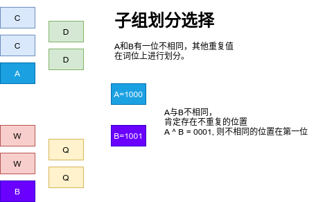

# 数组中数字出现的次数专题

[toc]

题目类型：数组、位运算

题目难度：:star2::star2::star2::star2:

## 只出现一次的数字I

- 问题描述

  ```
  问题描述：
  	给定一个非空整数数组，除了某个元素只出现一次以外，其余每个元素均出
  现两次。找出那个只出现了一次的元素
  
  解题思路：
  1. 交换律：a ^ b ^ c <=> a ^ c ^ b
  2. 任何数于0异或为任何数 0 ^ n => n
  3. 相同的数异或为0: n ^ n => 0
  
  示例：
  var a = [2,3,2,4,4]
  2 ^ 3 ^ 2 ^ 4 ^ 4等价于 2 ^ 2 ^ 4 ^ 4 ^ 3 => 0 ^ 0 ^3 => 3
  
  时间复杂度：O(N)
  空间复杂度：O(1)
  ```

- 代码（[解题思路](https://leetcode-cn.com/problems/single-number/comments/)）

  ```python
  class Solution:
      def singleNumber(self, nums) -> int:
          a = 0
          for num in nums:
              a = a ^ num
          return a
  ```

## 排序数组中只出现一次的数字
- 问题描述

  ```
  问题描述：
  	给定一个只包含整数的有序数组 nums ，每个元素都会出现两次，唯有一个
  数只会出现一次，请找出这个唯一的数字。
  
  进阶: 采用的方案可以在 O(log n) 时间复杂度和 O(1) 空间复杂度中运行吗？
  
  示例：
  输入: nums = [1,1,2,3,3,4,4,8,8]
  输出: 2
  
  解题思路：
  二分法
  
  时间复杂度：O(logN)
  空间复杂度：O(1)
  ```

- 代码

  ```python
  class Solution:
      def singleNonDuplicate(self, nums: List[int]) -> int:
  
          l, r = 0, len(nums) - 1
          while l < r:
              mid = (l + r)//2
              # 奇变偶不变
              mid -= mid&1
              if nums[mid] == nums[mid + 1]:
                  l = mid + 2
              else:
                  r = mid
  
          return nums[l]
  ```


## 数组中数字出现的次数 II

- 问题描述

  ```
  问题描述：
  	一个整型数组 nums 里除两个数字之外，其他数字都出现了两次。请写程序找出这
  两个只出现一次的数字。要求时间复杂度是O(n)，空间复杂度是O(1)。
  
  实例：
  输入：nums = [4,1,4,6]
  输出：[1,6] 或 [6,1]
  
  解题方法：
  位运算（异或运算）
  1001 ^ 0111 = 1110
  时间复杂度：O(N)
  空间复杂度：O(1)
  ```

- 代码（[解题思路](https://leetcode-cn.com/problems/shu-zu-zhong-shu-zi-chu-xian-de-ci-shu-lcof/solution/jian-zhi-offer-56-i-shu-zu-zhong-shu-zi-tykom/)）

  

  ```python
  class Solution(object):
      def singleNumbers(self, nums):
          """
          :type nums: List[int]
          :rtype: List[int]
          """
  
          x, y, n, m = 0, 0, 0, 1
          for num in nums:
              n ^= num  # x ^ y
          
          # 首个为1的位置
          while n & m == 0:
              m <<= 1
  
          # 各子组寻找不同值
          for num in nums:
              if num & m: x ^= num
              else: y ^= num
  
          return x, y 
  ```


## 数组中数字出现的次数 III

- 问题描述

  ```
  问题描述：
  在一个数组 nums 中除一个数字只出现一次之外，其他数字都出现了三次。请找出那个只出现一次的数字。
  ```

- 代码

  ```python
  class Solution:
      def singleNumber(self, nums: List[int]) -> int:
  
          res = 0
          for i in range(32):
              cnt = 0
              cnt = sum([((num >> i) &1) for num in nums])
              if cnt % 3:
                  if i == 31:
                      res -= 1 << i
                  else:
                      res |= 1 << i
          return res
  ```

## 数组中重复的数据IV

- 问题描述

  ```
  问题描述：
      给定一个整数数组 a，其中1 ≤ a[i] ≤ n （n为数组长度）, 其中有些元素出现两次而其他元素出现一次。
  找到所有出现两次的元素。你可以不用到任何额外空间并在O(n)时间复杂度内解决这个问题吗？
  
  解题方法：
  时间复杂度：O(N)
  空间复杂度：O(1)
  ```

- 代码

  ```python
  class Solution:
      def findDuplicates(self, nums: List[int]) -> List[int]:
  
          if not nums: return []
  
          res = []
          n = len(nums)
          for i in range(n):
              num = abs(nums[i])
              if nums[num - 1] < 0:
                  res.append(num)
              else:
                  nums[num - 1] = -nums[num - 1]
          return res
  ```
